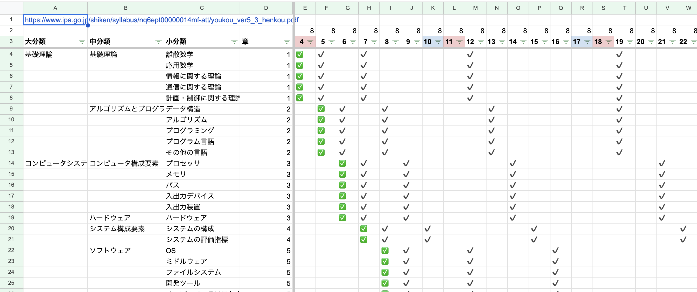

合格発表が2025年12月25日にありました。私としては午後Ⅱ試験を解答しきることができなかったので自信がなかったことと、年末の仕事が佳境だったことから発表当日はすっかり忘れていました。

会社の雑談チャットスペースで同僚が合格発表についてコメントしていたのを年明けに気がつき、一応確認しに行ったところ合格していましたので運よく配点が高いところを取ることができたのでしょう。午後Ⅱも7〜8割の得点だったみたいで嬉しさもありましたが不思議だという気持ちもありました。

## 応用情報技術者試験(2024年秋季)の学習戦略

今回の学習戦略の話をする前に前年の話をします。2024年には応用情報技術者試験を受けました。これが私にとって人生初のIPAの試験でした。

仕事柄自信はありましたが、試験範囲の中には馴染みの少ない分野もあったため広い範囲の知識を底上げすることをメインテーマとして学習をしました。具体的には、シラバスをカバーしていそうな参考書を1冊購入しまして、定期的に復習をしながら毎日少しずつ学習を進めていくという分散学習と呼ばれる方法で取り組みました。

結果、合格できたのでこの手法は一定の効果があったと考えられます。

## データベーススペシャリスト試験(2025年秋季)の学習戦略

今回も2024年と同様分散学習の手法で学習をしていこうと当初は考えていました。しかし、今回の出題範囲はほぼDBに集中しており、馴染みない分野ではないという状況の違いがありました。いくつか過去問を解いてみたところ、以下の弱点が見つかりました。

- 問題文の業務要件を理解するのに時間がかかってしまう
- パフォーマンス計算が苦手

そこで、過去問を解いて間違ったところをAIと壁打ちし、理解に繋げる。というのをひたすら繰り返していく手法を取ることにしました。結果、ある程度苦手も克服できましたが、物流系のケースにおいてのみ業務要件を理解しきることができないままでした。対策として、仮に当日に午後Ⅰや午後Ⅱで物流系のケースが出た時は別の問題を選択しようと固く誓ったのでした。

合計の学習時間としては、70時間程度でした。7月に入ってから体調不良や旅行等のぞいて毎日おおよそ1時間ずつ勉強していました。その中で[bondaviの集中アプリ](https://bondavi.jp/products/shuchu)が時間管理に本当に役に立ったことも記しておきます。

---

当日ですが、午後Ⅱでまさかの物流の問題が出てきました。事前に決めておいたルールによればもう一方の問題に取り組むべきだったのですが、過去問で解いたものと業務要件が非常に似てると思ったためか、気がついたらその問題に取り組んでいました。

結局苦手なのは変わらす試験時間中盤あたりですごく後悔したのですが、その時は引き返す時間もありませんでした。できるだけ空欄を無くすことと、概念データモデルを完成させることに力を注いだものの、自信は全くなく失意のまま冒頭のXのpostをしたのですが、何があるかわからないものですね。本当に運が良かったんだと思います。

当分は試験など受けないと思いますが、次の課題としては試験当日の戦略なのかもしれません。