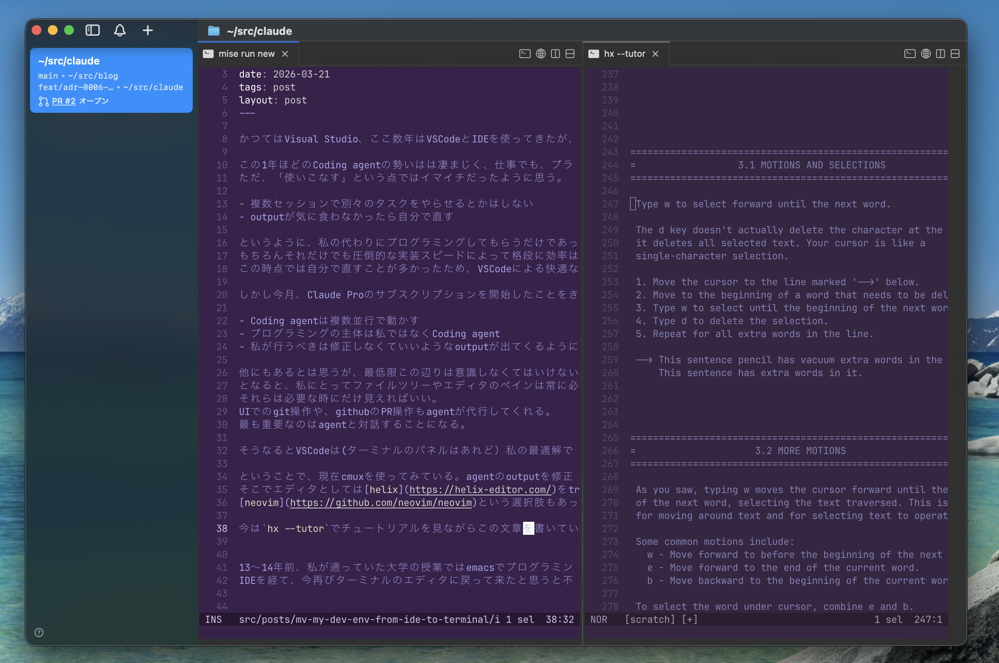

かつてはVisual Studio、ここ数年はVSCodeとIDEを使ってきたが、先日からプライベートではターミナルに環境を引っ越している。

この1年ほどのCoding agentの勢いは凄まじく、仕事でも、プライベートでもその恩恵を受けている。
ただ、「使いこなす」という点ではイマイチだったように思う。

- 複数セッションで別々のタスクをやらせるとかはしない
- outputが気に食わなかったら自分で直す

というように、私の代わりにプログラミングしてもらうだけであった。
もちろんそれだけでも圧倒的な実装スピードによって格段に効率はよくなっていた。
この時点では自分で直すことが多かったため、VSCodeによる快適なコーディング環境は手放せないものだった。

しかし今月、Claude Proのサブスクリプションを開始したことをきっかけに、私にとって最も効率が良くなる開発環境とは何かを考え始めている。

- Coding agentは複数並行で動かす
- プログラミングの主体は私ではなくCoding agent
- 私が行うべきは修正しなくていいようなoutputが出てくるように環境とinputを整備する

他にもあるとは思うが、最低限この辺りは意識しなくてはいけないと思っている。
つまり、私にとってファイルツリーやエディタのペインが常に必要なものではなくなる。
それらは必要な時にだけ見えればいい。
UIでのgit操作や、GitHubのPR操作もagentが代行してくれる。
最も重要なのはagentと対話することになる。

そうなるとVSCodeにはターミナルのパネルこそあれど、私の最適解ではないのだろう。メモリ結構使うし。

ということで、現在cmuxを使ってみている。agentのoutputを直接修正することはほぼやめたとはいえ、エディタを使う機会はゼロではない。
そこでエディタとしては[helix](https://helix-editor.com/)をtryしている。
[neovim](https://github.com/neovim/neovim)という選択肢もあったが、プラグインの管理をしたくないのでhelixとなった。

今はhelixの練習のために`hx --tutor`でチュートリアルを見ながらこの文章を書いている。

（helixデフォルトの紫背景はなんとかしたい）

13〜14年前、私が通っていた大学の授業ではemacsでプログラミングの講義が行われ、研究室ではvimを使ってC言語でシミュレーション用のプログラムを書いていた。
IDEを経て、今再びターミナルのエディタに戻って来たと思うと不思議な気持ちになる。
