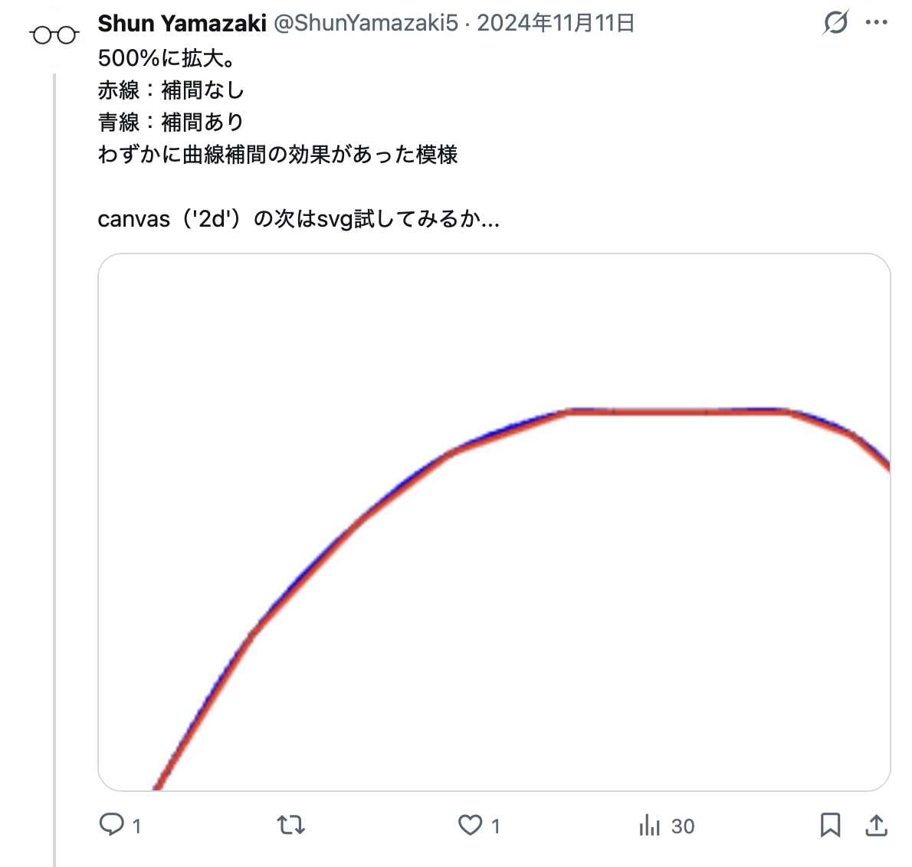
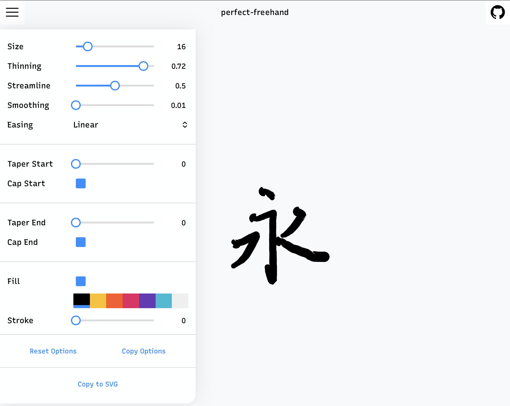

2022年の転職を機に、何かと勉強する機会が増えました。私は書いて覚えるスタイルで学習することが多いのでiPadとApple Pencilが学習における必須アイテムとなっています。そうしてデジタル手書きに触れてきたこともあり、その実装、特にどうやったら紙とペンの文字の書きごこちに近づけられるかに興味を持っています。

## 背景

過去、canvas2dやsvgで滑らかな曲線を描くことは試していました。



いずれの場合も、検出したPointerEventの点をただ繋ぐだけではハネや払いを再現するのは難しそうです。[perfect-freehand(github)](https://github.com/steveruizok/perfect-freehand)のようにPointerEventを繋いだ線を囲うようなアウトラインを描画する必要があります。

ちなみに、そのperfect-freehandはデモサイトで確認した限りだとこんな感じでした。



## 実装の試行

日本語のハネ、払いについては筆圧が大きく関わってくるだろうという想定で`onpointermove`イベントの度に`PointerEvent.pressure`の定数倍を半径とした円を描画してみました。

```ts
/** onpointermoveイベントのハンドラ */
const handlePointerMove = (ev: PointerEvent) => {
    if (!isPointerDown.value) {
        return
    }
    ev.stopImmediatePropagation();

    const canvas = document.getElementById(CANVAS_ID) as HTMLCanvasElement;
    const ctx = canvas.getContext("2d");
    if (!ctx) {
        return;
    }

    ctx.strokeStyle = "black";
    const size = ev.pressure * 10; // わかりやすいよう定数倍
    ctx.beginPath();
    ctx.ellipse(ev.offsetX, ev.offsetY, size, size, 0, 0, 2 * Math.PI);
    ctx.stroke(); 
    ctx.closePath();
}
```


もうほとんどこれでいいんじゃないかみたいなのができました。次はこの円たちのアウトラインを引くことを考えます。1つ前の点を覚えておいて、現在の点との線分に直行する形のベクトルを計算してやれば良さそうです。


いい感じに見えますが、折り返し部分については補間を考える必要がありそうです。Roud Joinを実装してみます。


急角度の折り返しについてもアウトラインを上手く引くことができてそうです。

最後はこれらを塗りつぶす形式にします。


...

canvas2dではpathが交差する部分で白く飛ぶ現象があるかもしれません。試しに近い場所で発生したPointerEventを間引く処理も試しましたが、回避は難しかったのでRound Joinは断念しました。

1セグメント毎に関節となる円を描画する形に変えてみました。


何の問題もなく描画できました。アウトラインがわずかに角張っているため、曲線補完をする予定です。一旦、ハネや払いについては満足できるところまで進められました。

今後はこのsegment方式をベースに進めていこうと思います。